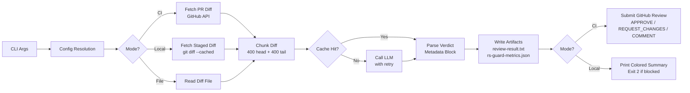

# rs-guard


**AI-powered code review CLI for GitHub Pull Requests.** Multi-provider LLM support, response caching, exponential backoff retry, and local pre-commit execution — all in a single Rust binary.

[](https://github.com/nebulaideas/rs-guard/actions/workflows/ci.yml)
[](https://opensource.org/licenses/MIT)
[](https://crates.io/crates/rs-guard)
[](https://docs.rs/rs-guard)

---

## Features

- 🤖 **Multi-provider LLM** — DeepSeek, Kimi (Moonshot AI), Qwen (Alibaba Cloud), OpenRouter, OpenAI
- ⚡ **Response caching** — SHA-256 keyed, 24-hour TTL, 100 MB limit; skip with `--no-cache`
- 🔄 **Automatic retry** — Exponential backoff (1s/2s/4s ±25% jitter) + optional circuit breaker
- 🔍 **In-memory verdict parsing** — Structured metadata block; no intermediate comment spam
- 📊 **Metrics export** — Per-run JSON artifact with token counts, latency, and cost estimate
- ⚙️ **CI + local mode** — GitHub Actions submits reviews; git pre-commit hook blocks bad commits
- 📄 **Configurable prompts** — Per-repository `.github/review-prompt.md` or `.reviewer.toml`
- 🔒 **SSRF protection** — URL allowlist per provider; `Authorization` headers never sent to unknown hosts
- 📦 **Single binary** — No runtime dependencies; ~3s typical execution

---

## Quick Start

### 1. Download the binary

```bash
curl -L -o rs-guard \
  https://github.com/nebulaideas/rs-guard/releases/latest/download/rs-guard
chmod +x rs-guard
```

### 2. Set your API key

```bash
export DEEPSEEK_API_KEY="your-api-key"
```

### 3. Add to GitHub Actions

```yaml
# .github/workflows/ai-review.yml
- name: AI Code Review
  run: rs-guard
  env:
    DEEPSEEK_API_KEY: ${{ secrets.DEEPSEEK_API_KEY }}
    GITHUB_TOKEN: ${{ secrets.GITHUB_TOKEN }}
    PR_NUMBER: ${{ github.event.pull_request.number }}
    REPO_FULL_NAME: ${{ github.repository }}
```

See [`examples/github-actions-workflow/`](examples/github-actions-workflow/) for full workflow files, including framework-specific examples for React/Vite and Rails.

---

## Installation

### Pre-built binary (Recommended)

Download from [GitHub Releases](https://github.com/nebulaideas/rs-guard/releases).
See [docs/INSTALLATION.md](docs/INSTALLATION.md) for platform-specific instructions (Linux, macOS, Windows).

### Build from source

```bash
git clone https://github.com/nebulaideas/rs-guard.git
cd rs-guard
cargo build --release
# Binary at: ./target/release/rs-guard
```

Requires Rust 1.82+.

### cargo install

```bash
cargo install rs-guard
```

After installation, the `rs-guard` binary will be available in your `~/.cargo/bin` directory.
**Note:** Requires the crate to be published on crates.io. Before publication, use "Build from source" instead.

---

## Usage

### CI Mode (GitHub Actions)

Auto-detected when `GITHUB_ACTIONS=true`. Fetches the PR diff from the GitHub API, sends it to the LLM, and submits an `APPROVE`, `REQUEST_CHANGES`, or `COMMENT` review.

```bash
rs-guard --provider deepseek --model deepseek-v4-flash
```

### Local Mode (Pre-commit)

Auto-detected when `GITHUB_ACTIONS` is absent. Analyzes `git diff --cached` and prints a colored terminal summary. Exits with code `2` on `REQUEST_CHANGES` to abort the commit.

```bash
# Stage your changes, then:
rs-guard

# Bypass the review:
git commit --no-verify
```

### Pre-built hook setup

```bash
cp examples/local-review/pre-commit-hook.sh .git/hooks/pre-commit
chmod +x .git/hooks/pre-commit
```

See [docs/LOCAL_MODE.md](docs/LOCAL_MODE.md) for full setup instructions, including Husky and Lefthook integration for JS/TS projects.

### CLI Reference

```text
rs-guard [OPTIONS]

Options:
  -p, --prompt-file <PATH>    System prompt markdown file [default: .github/review-prompt.md]
  -m, --model <MODEL>         LLM model identifier (provider default if omitted)
  -t, --temperature <TEMP>    Sampling temperature 0.0–2.0 [default: 0.1]
      --provider <PROVIDER>   LLM provider [default: deepseek]
  -c, --config <PATH>         Configuration TOML file [default: .reviewer.toml]
      --max-tokens <N>        Maximum tokens for LLM completions
      --diff-file <PATH>      Review a pre-existing diff file instead of fetching from GitHub
      --no-cache              Bypass response cache, force a fresh LLM API call
      --dry-run               Run the full pipeline without submitting reviews or blocking commits
  -h, --help                  Print help
  -V, --version               Print version
```

See [docs/USAGE.md](docs/USAGE.md) for the complete reference including all environment variables, exit codes, and troubleshooting.

---

## Environment Variables

| Variable                | When Required       | Description                                             |
| ----------------------- | ------------------- | ------------------------------------------------------- |
| `DEEPSEEK_API_KEY`      | DeepSeek provider   | [DeepSeek Platform](https://platform.deepseek.com)      |
| `KIMI_API_KEY`          | Kimi provider       | [Moonshot AI](https://platform.moonshot.cn)             |
| `DASHSCOPE_API_KEY`     | Qwen provider       | [Alibaba Cloud DashScope](https://dashscope.aliyun.com) |
| `OPENROUTER_API_KEY`    | OpenRouter provider | [OpenRouter](https://openrouter.ai)                     |
| `OPENAI_API_KEY`        | OpenAI provider     | [OpenAI Platform](https://platform.openai.com)          |
| `GITHUB_TOKEN`          | CI mode             | Auto-provided by GitHub Actions                         |
| `PR_NUMBER`             | CI mode             | Pull request number                                     |
| `REPO_FULL_NAME`        | CI mode             | Repository in `owner/repo` format                       |
| `RS_GUARD_PROVIDER`     | Optional            | Override provider via env var                           |
| `RS_GUARD_MODEL`        | Optional            | Override model via env var                              |
| `RS_GUARD_TEMPERATURE`  | Optional            | Override temperature via env var                        |
| `RS_GUARD_MAX_TOKENS`   | Optional            | Override max tokens via env var                         |
| `RS_GUARD_DIFF_FILE`    | Optional            | Path to a pre-existing diff file                        |
| `RS_GUARD_METRICS_PATH` | Optional            | Path for the metrics JSON artifact                      |
| `GITHUB_API_URL`        | Optional            | Custom GitHub API base URL (Enterprise)                 |

See [docs/PROVIDERS.md](docs/PROVIDERS.md) for per-provider setup details.

---

## Configuration

Create `.reviewer.toml` in your repository root to set team-wide defaults. Resolution order: **CLI flags → environment variables → TOML file → defaults**.

```toml
provider = "deepseek"
model = "deepseek-v4-flash"
temperature = 0.1

[providers.deepseek]
api_key_env = "DEEPSEEK_API_KEY"
base_url = "https://api.deepseek.com"

[providers.openrouter]
api_key_env = "OPENROUTER_API_KEY"
http_referer = "https://github.com/your-org/your-repo"
```

See [docs/CONFIGURATION.md](docs/CONFIGURATION.md) for the full schema reference.

---

## Review State Logic

```bash
if verdict == "NEGATIVE" or security_issues > 0 or critical_bugs > 2:
    → REQUEST_CHANGES
else if critical_bugs == 0 and security_issues == 0:
    → APPROVE
else:
    → COMMENT
```

**Asymmetric safety model:** pessimistic signals are always trusted; optimistic signals require clean counts. A positive verdict with 1–2 critical bugs yields `COMMENT` so a human can decide — never auto-approved.

If `REQUEST_CHANGES` or `APPROVE` fails due to GitHub token permissions (403), the state is downgraded to `COMMENT` with a `[Bot fallback from {state}]` prefix.

---

## Architecture



All LLM processing is in-memory. No intermediate comments are posted during analysis. See [docs/ARCHITECTURE.md](docs/ARCHITECTURE.md) for the full design documentation.

---

## Exit Codes

| Code | Meaning                                                             |
| ---- | ------------------------------------------------------------------- |
| `0`  | Review completed successfully                                       |
| `1`  | Error occurred (API failure, config error, parse error, etc.)       |
| `2`  | Local mode only: review returned `REQUEST_CHANGES` (commit blocked) |

---

## Development

```bash
# Build
cargo build

# Full test suite (~260 tests)
cargo test

# Lint (zero warnings policy)
cargo clippy --all-targets --all-features -- -D warnings

# Format
cargo fmt --all

# Benchmarks
cargo bench --bench verdict

# Security audits
cargo deny check
cargo install cargo-audit --locked  # one-time setup
cargo audit

# Documentation
cargo doc --no-deps --open
```

---

## Documentation

| Document                                       | Description                                                               |
| ---------------------------------------------- | ------------------------------------------------------------------------- |
| [docs/INSTALLATION.md](docs/INSTALLATION.md)   | **Complete installation guide** for all platforms (Linux, macOS, Windows) |
| [docs/ARCHITECTURE.md](docs/ARCHITECTURE.md)   | System design, Mermaid diagrams, security model                           |
| [docs/USAGE.md](docs/USAGE.md)                 | Full CLI reference, GitHub Actions guide, troubleshooting                 |
| [docs/API.md](docs/API.md)                     | Module API docs, custom provider implementation guide                     |
| [docs/PROVIDERS.md](docs/PROVIDERS.md)         | Per-provider setup and API key acquisition                                |
| [docs/CONFIGURATION.md](docs/CONFIGURATION.md) | `.reviewer.toml` full schema reference                                    |
| [docs/LOCAL_MODE.md](docs/LOCAL_MODE.md)       | Pre-commit hook setup                                                     |

---

## License

MIT License — Copyright 2026 Nebula Ideas. See [LICENSE](LICENSE) for details.
