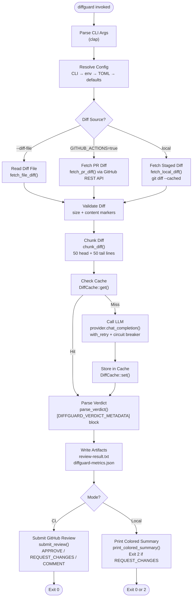
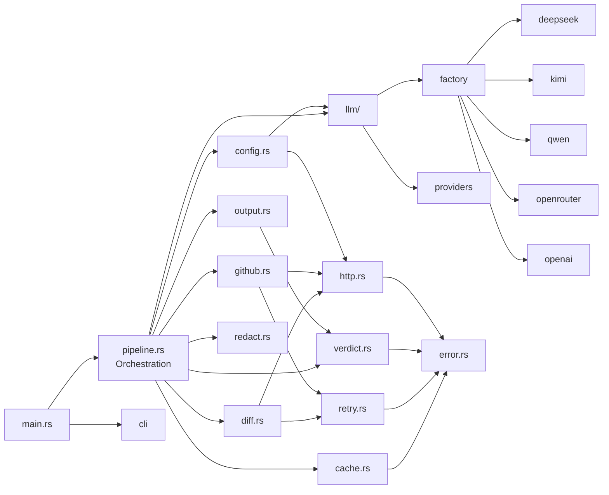
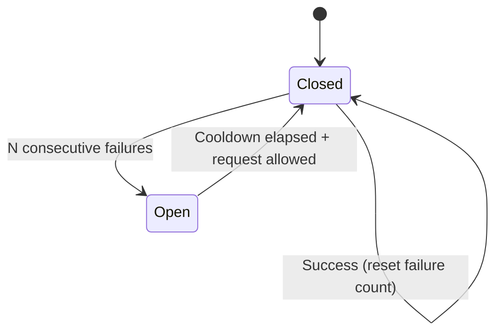
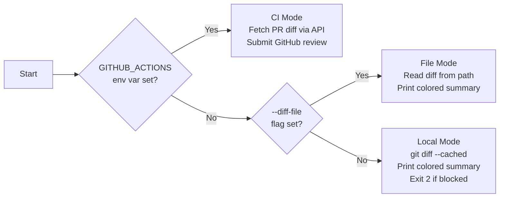

# diffguard-rs — Architecture

This document describes the system design, key decisions, and extension points of diffguard-rs.

---

## Overview

diffguard-rs is a **single-binary, single-pass review pipeline**. It fetches a diff, calls an LLM once, parses the structured response, and either submits a GitHub review (CI mode) or prints a colored terminal summary (local mode). No intermediate state is persisted, no comments are posted during analysis, and no database or server is required.

---

## Pipeline Flow



---

## Module Structure



---

## Key Modules

### `pipeline.rs` — Orchestration

The single entry point for all review logic. `run_pipeline()` accepts a `Config` and optional diff file path, drives the full workflow, and returns a `PipelineResult` enum instead of calling `process::exit()`. This keeps the library testable without subprocess spawning.

```rust
pub enum PipelineResult {
    Success,       // exit 0
    ReviewBlocked, // exit 2 — local mode REQUEST_CHANGES
}
```

### `llm/` — Provider Abstraction

All providers implement the `LlmProvider` async trait:

```rust
#[async_trait]
pub trait LlmProvider: Send + Sync {
    async fn chat_completion(
        &self,
        system_prompt: &str,
        user_content: &str,
        temperature: f32,
    ) -> Result<String, DiffguardError>;
}
```

The `factory.rs` module maps a provider name string to a `Box<dyn LlmProvider>`. Adding a new provider requires:
1. A new module in `src/llm/` implementing the trait
2. An entry in `providers.rs` (metadata: name, env var, default model, base URL)
3. A match arm in `factory.rs`

See [docs/API.md](API.md) for a complete step-by-step guide.

### `cache.rs` — Response Caching

Cache entries are keyed by a SHA-256 hash of all LLM call parameters:

```
key = SHA-256(diff_content | prompt | provider | model | temperature)
```

Each `.cache` file stores:
- **Line 1:** Unix timestamp (seconds since epoch) — stored in content, not mtime, for reliability
- **Line 2+:** The raw LLM response

Writes are atomic: content is written to a `.tmp` file in the same directory, then renamed into place. This prevents partial reads from concurrent diffguard processes.

The cache enforces a configurable maximum size (default: 100 MB) using LRU cleanup: entries are sorted by stored timestamp and the oldest are removed until the total falls below the limit.

### `retry.rs` — Retry + Circuit Breaker

**Retry policy:** Up to 3 retries with exponential backoff (1s, 2s, 4s base) and ±25% jitter. Only retries on retryable errors (429, 5xx, timeouts). Non-retryable errors (404, 401, 403) are returned immediately.

**Circuit breaker:** Simple two-state (Closed/Open). Opens after N consecutive failures; auto-resets to Closed after a configurable cooldown. No half-open state (keeps complexity low for v1). Thread-safe via `Arc<Mutex<>>`. Opt-in, disabled by default.



### `diff.rs` — Diff Fetching + Chunking

Three diff sources with different behavior:

| Source | Function | On `DiffTooLarge` |
|---|---|---|
| GitHub API (`--ci`) | `fetch_pr_diff()` | Posts an explanatory `COMMENT` review |
| File (`--diff-file`) | `fetch_file_diff()` | Prints to stderr, exits 0 |
| Local (`git diff --cached`) | `fetch_local_diff()` | Prints to stderr, exits 0 |

After fetching, `chunk_diff()` trims large diffs to the first 50 + last 50 lines. Returns `Cow<str>` — borrowed when no truncation is needed (zero allocation in the common case).

### `verdict.rs` — Verdict Parsing

The LLM is instructed to append a structured block at the end of its response:

```
[DIFFGUARD_VERDICT_METADATA]
Verdict: POSITIVE
CriticalBugs: 0
SecurityIssues: 0
```

The parser extracts this block using regex, strips it from the display text, and applies the review state logic:

```
NEGATIVE or security_issues > 0 or critical_bugs > 2  →  REQUEST_CHANGES
critical_bugs == 0 and security_issues == 0            →  APPROVE
otherwise                                              →  COMMENT
```

### `github.rs` — Review Submission

Submits reviews via the GitHub REST API (`POST /repos/{owner}/{repo}/pulls/{pr}/reviews`). Includes `<!-- diffguard-bot -->` as an HTML comment signature in the review body for identification.

When the new state is non-blocking (`APPROVE` or `COMMENT`), any previous diffguard `CHANGES_REQUESTED` reviews are dismissed to clean up the PR review list.

Fallback: if `APPROVE` or `REQUEST_CHANGES` fails with HTTP 403 (insufficient token permissions), the state is downgraded to `COMMENT` and resubmitted.

---

## CI vs Local Mode Detection



---

## Security Model

### SSRF Protection

All provider base URLs are validated against a per-provider allowlist before any HTTP request is made. This ensures that `Authorization` headers containing API keys are never sent to an attacker-controlled host.

- **CI mode (GitHub API):** URL must match `api.github.com` or the configured GitHub Enterprise base URL.
- **Provider APIs:** URL must match the known canonical base URL for the provider.
- **Local/test mode:** Loopback addresses (`127.0.0.1`, `localhost`, `[::1]`) are allowed — enables wiremock-based testing.

### Secret Handling

- API keys are read from environment variables, never from the diff content or command-line arguments.
- The `redact.rs` module strips known secret patterns from LLM responses before writing artifacts or submitting reviews.
- `log_redacted()` truncates sensitive content in debug log output.
- Secrets are never written to the response cache.

### Token Permissions

diffguard-rs requests the minimum GitHub token scope needed: `pull-requests: write`. If the token only has `read` permission, the submission is downgraded to `COMMENT` (which requires only `read` for public repos, or a token that can post comments).

---

## Performance Characteristics

| Metric | Typical Value |
|---|---|
| Binary size (release, stripped) | ~5 MB |
| Cold startup to first API call | < 100ms |
| End-to-end latency (cache miss) | 3–15s (LLM-dominated) |
| End-to-end latency (cache hit) | < 200ms |
| Memory footprint | < 50 MB |
| Diff size limit | 100 KB / 1500 lines |

The Criterion benchmarks in `benches/verdict.rs` cover verdict parsing (the only CPU-intensive step). Run with:

```bash
cargo bench --bench verdict
```

---

## Extending the Codebase

### Adding a New LLM Provider

See [docs/API.md](API.md#adding-a-new-provider).

### Adding a New Diff Source

1. Add a new function in `diff.rs` returning `Result<DiffResult, DiffguardError>`
2. Add the corresponding CLI flag or env var detection in `cli.rs` / `config.rs`
3. Add a new branch in the diff-source `if/else` block in `pipeline.rs`
4. Handle the `DiffTooLarge` case consistently with the existing sources

### Modifying the Verdict Format

The metadata block format is defined in the default prompt (`config.rs::DEFAULT_PROMPT`) and parsed in `verdict.rs::parse_verdict()`. Both must be kept in sync. Add tests to `verdict_tests.rs` for any new fields.
