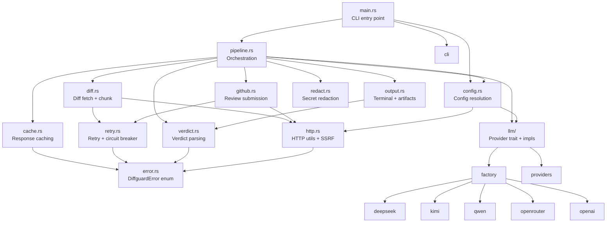
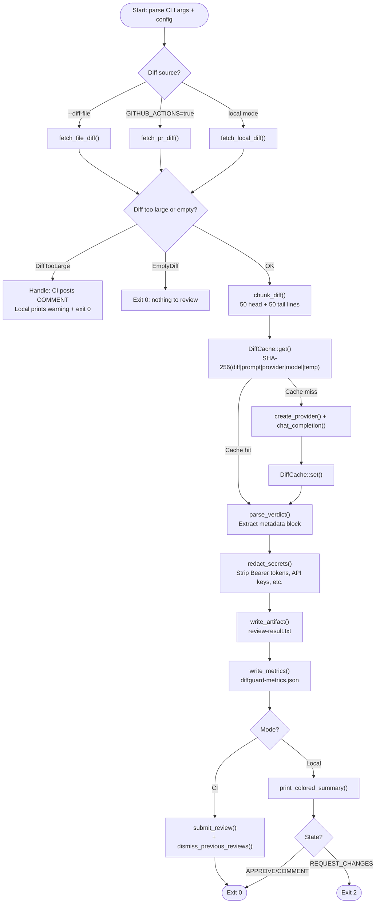

# diffguard-rs — Implementation Guide

How the project is built, how to extend it, and the architectural decisions behind key design choices. This is the developer-facing companion to the user-facing documentation.

---

## Table of Contents

- [1. Getting Started for Contributors](#1-getting-started-for-contributors)
- [2. Crate Organization](#2-crate-organization)
- [3. Adding a New LLM Provider](#3-adding-a-new-llm-provider)
- [4. The In-Memory Pipeline](#4-the-in-memory-pipeline)
- [5. Testing Strategy](#5-testing-strategy)
- [6. CI/CD Pipeline](#6-cicd-pipeline)
- [7. Performance Considerations](#7-performance-considerations)
- [8. Security Model](#8-security-model)
- [9. Common Tasks](#9-common-tasks)

---

## 1. Getting Started for Contributors

### Rust Toolchain

diffguard-rs requires **Rust 1.82** or later (set in `Cargo.toml` → `rust-version = "1.82"`). Install via [rustup](https://rustup.rs):

```bash
rustup install stable
rustup component add clippy rustfmt
```

### Daily Development Commands

```bash
# Build
cargo build

# Run full test suite (~220 tests, all offline with wiremock)
cargo test

# Lint — zero warnings required
cargo clippy --all-targets --all-features -- -D warnings

# Format check
cargo fmt --all -- --check

# Apply formatting
cargo fmt

# Generate and open documentation
cargo doc --no-deps --open

# Run benchmarks (verdict parsing only)
cargo bench --bench verdict -- --quick
```

### Running Integration Tests

All tests use `wiremock` for HTTP mocking and `tempfile` for filesystem isolation. No network access or external services are required:

```bash
# Every test, including integration tests
cargo test

# A specific test module
cargo test --test provider_tests

# A specific test by name
cargo test test_full_pipeline_approve
```

There are no `#[ignored]` tests that require network access. Every test is self-contained.

### Generating Coverage Reports

```bash
# Install tarpaulin if not present
cargo install cargo-tarpaulin

# Run with coverage
cargo tarpaulin --workspace --out Xml --output-dir target/coverage
```

Target: **85%+ coverage**.

---

## 2. Crate Organization

### Why a Single Crate

diffguard-rs is a single crate with 13 public modules. This was a deliberate choice, not an oversight:

- **Faster iteration.** No cross-crate compilation boundaries. Refactoring is a single `cargo check`.
- **Simpler testing.** Unit tests access private modules via `#[cfg(test)]`. No need to expose internals prematurely.
- **Less boilerplate.** One `Cargo.toml`, one version to bump, no workspace dependency management.
- **YAGNI.** No identified consumer needs `diffguard-llm` or `diffguard-core` as standalone libraries.

The crate root (`src/lib.rs`) exposes 13 public modules:

```rust
pub mod cache;
pub mod cli;
pub mod config;
pub mod diff;
pub mod error;
pub mod github;
pub mod http;
pub mod llm;
pub mod output;
pub mod pipeline;
pub mod redact;
pub mod retry;
pub mod verdict;
```

`main.rs` is a thin CLI entry point (66 lines) that parses args, loads config, calls `run_pipeline()`, and maps `PipelineResult` to exit codes.

### Module Dependency Flow



**Key design rule:** `pipeline.rs` is the single orchestrator. Lower-level modules never depend on higher-level ones. The dependency graph flows strictly downward.

### When and How to Split Into a Workspace

Split into a workspace only if concrete demand emerges for using `diffguard` components as standalone libraries. The migration path:

1. Create workspace `Cargo.toml` with `[workspace.members]`
2. Extract `src/llm/` → `crates/diffguard-llm/src/`
3. Extract `src/diff.rs`, `src/verdict.rs`, `src/github.rs`, `src/output.rs`, `src/error.rs` → `crates/diffguard-core/src/`
4. Keep `src/main.rs`, `src/cli.rs`, `src/config.rs` → `crates/diffguard-cli/src/`
5. Add `diffguard-core` and `diffguard-llm` as path dependencies in `diffguard-cli/Cargo.toml`
6. Use `[workspace.dependencies]` to share common crate versions
7. Update all `use` statements and test imports
8. Update CI to use `--workspace` flag

**Why we didn't start here:** Workspace boundaries add friction to early iteration. Internal APIs change frequently during MVP development. Splitting is easy to do later; merging is painful to undo.

---

## 3. Adding a New LLM Provider

This section walks through adding a provider end-to-end. We will use **Groq** as a concrete example.

### Step 1: Create the Provider Module

Create `src/llm/groq.rs`. The provider uses the `async_trait` crate (already in `Cargo.toml`) to implement the async `LlmProvider` trait:

```rust
//! Groq LLM provider implementation.

use crate::error::DiffguardError;
use crate::llm::{build_llm_client, chat_messages, send_chat_request, ChatRequest, LlmProvider};
use async_trait::async_trait;

/// Default Groq API base URL.
const DEFAULT_BASE_URL: &str = "https://api.groq.com/openai/v1";

/// Default model identifier for Groq.
const DEFAULT_MODEL: &str = "llama-3.3-70b-versatile";

/// Client for the Groq chat completions API.
#[derive(Debug, Clone)]
pub struct GroqClient {
    base_url: String,
    model: String,
    max_tokens: Option<u32>,
    client: reqwest::Client,
}

impl GroqClient {
    /// Creates a new Groq client with the given API key.
    pub fn new(api_key: impl Into<String>) -> Result<Self, DiffguardError> {
        let client = build_llm_client("groq", &api_key.into(), &[])?;
        Ok(Self {
            base_url: DEFAULT_BASE_URL.to_string(),
            model: DEFAULT_MODEL.to_string(),
            max_tokens: None,
            client,
        })
    }

    /// Sets a custom base URL for the API endpoint.
    pub fn with_base_url(mut self, base_url: impl Into<String>) -> Self {
        self.base_url = base_url.into();
        self
    }

    /// Sets a custom model identifier.
    pub fn with_model(mut self, model: impl Into<String>) -> Self {
        self.model = model.into();
        self
    }

    /// Sets the maximum tokens for completions.
    pub fn with_max_tokens(mut self, max_tokens: Option<u32>) -> Self {
        self.max_tokens = max_tokens;
        self
    }
}

#[async_trait]
impl LlmProvider for GroqClient {
    fn name(&self) -> &'static str {
        "groq"
    }

    async fn chat_completion(
        &self,
        system_prompt: &str,
        user_message: &str,
        temperature: f32,
    ) -> Result<String, DiffguardError> {
        let request = ChatRequest {
            model: self.model.clone(),
            messages: chat_messages(system_prompt, user_message),
            temperature,
            max_tokens: self.max_tokens,
        };

        let url = format!("{}/chat/completions", self.base_url);
        send_chat_request(&self.client, &url, &request, "groq").await
    }
}
```

Every provider follows this pattern: `new()` validates the API key via `build_llm_client`, builder methods configure overrides, and `chat_completion()` delegates to `send_chat_request`.

### Step 2: Register the Module

Add to `src/llm/mod.rs`:

```rust
pub mod groq;
```

### Step 3: Add Provider Metadata

Add an entry in `src/llm/providers.rs` → `all_providers()`:

```rust
ProviderMeta {
    name: "groq",
    default_base_url: "https://api.groq.com/openai/v1",
    default_model: "llama-3.3-70b-versatile",
    api_key_env: "GROQ_API_KEY",
    ci_allowed_hosts: &[("https", "api.groq.com")],
},
```

This automatically includes `api.groq.com` in the CI SSRF allowlist.

### Step 4: Add Factory Match Arm

Add to `src/llm/factory.rs` → `create_provider()`:

```rust
"groq" => {
    let mut client = groq::GroqClient::new(api_key)?;
    if let Some(ref url) = config.base_url {
        client = client.with_base_url(url.clone());
    }
    client = client
        .with_model(config.model.clone())
        .with_max_tokens(config.max_tokens);
    Ok(Box::new(client))
}
```

### Step 5: Add Config Wiring

The API key is resolved by environment variable name from `ProviderMeta.api_key_env`. In `src/config.rs`, no changes are needed if you follow the convention of naming the env var `<PROVIDER_NAME>_API_KEY` — the factory looks up the env var name from `providers.rs` automatically.

To make it configurable via `.reviewer.toml`, add a section to the TOML schema documentation in `docs/CONFIGURATION.md`:

```toml
[providers.groq]
api_key_env = "GROQ_API_KEY"
base_url = "https://api.groq.com/openai/v1"
```

### Step 6: Add Tests

Add inline unit tests in `src/llm/groq.rs`:

```rust
#[cfg(test)]
mod tests {
    use super::*;
    use wiremock::matchers::{method, path};
    use wiremock::{Mock, MockServer, ResponseTemplate};

    #[tokio::test]
    async fn test_chat_completion_success() {
        let mock_server = MockServer::start().await;
        Mock::given(method("POST"))
            .and(path("/chat/completions"))
            .respond_with(ResponseTemplate::new(200).set_body_json(serde_json::json!({
                "choices": [{
                    "message": {
                        "content": "Looks good.\n\n[DIFFGUARD_VERDICT_METADATA]\nVerdict: POSITIVE\nCriticalBugs: 0\nSecurityIssues: 0"
                    }
                }]
            })))
            .mount(&mock_server)
            .await;

        let client = GroqClient::new("test-key")
            .unwrap()
            .with_base_url(mock_server.uri());
        let result = client
            .chat_completion("You are a reviewer.", "diff content", 0.1)
            .await;
        assert!(result.is_ok());
        assert!(result.unwrap().contains("POSITIVE"));
    }

    #[tokio::test]
    async fn test_chat_completion_api_error() {
        let mock_server = MockServer::start().await;
        Mock::given(method("POST"))
            .and(path("/chat/completions"))
            .respond_with(ResponseTemplate::new(500).set_body_string("Internal Server Error"))
            .mount(&mock_server)
            .await;

        let client = GroqClient::new("test-key")
            .unwrap()
            .with_base_url(mock_server.uri());
        let result = client
            .chat_completion("You are a reviewer.", "diff content", 0.1)
            .await;
        assert!(result.is_err());
    }
}
```

Add an integration test to `tests/provider_tests.rs` that creates a Groq client via the factory.

### Step 7: Update Documentation

- `docs/PROVIDERS.md` — Add Groq section with API key acquisition, CLI usage, TOML config
- `docs/USAGE.md` — Add `groq` to the provider list
- `docs/CONFIGURATION.md` — Add Groq TOML section
- `README.md` — Add Groq to supported providers table

### Provider Implementation Checklist

After implementing a new provider, verify every item:

- [ ] Implement `LlmProvider` trait (`name()` + `chat_completion()`)
- [ ] Use shared helpers: `build_llm_client()`, `chat_messages()`, `send_chat_request()`
- [ ] Add module to `src/llm/mod.rs`
- [ ] Register metadata in `all_providers()` in `src/llm/providers.rs` (including `ci_allowed_hosts`)
- [ ] Add match arm in `src/llm/factory.rs`
- [ ] Add inline unit tests with `wiremock` mock responses
- [ ] Add integration test via the factory (`create_provider("groq", ...)`)
- [ ] Update `docs/PROVIDERS.md`, `docs/USAGE.md`, `docs/CONFIGURATION.md`
- [ ] Verify CI passes: `cargo fmt`, `cargo clippy`, `cargo test`

---

## 4. The In-Memory Pipeline

### Why Parse Metadata In-Memory

diffguard-rs processes the entire review in a single pass. The LLM returns a structured `[DIFFGUARD_VERDICT_METADATA]` block at the end of its response, which `verdict.rs` extracts in-memory.

This design avoids the alternative approach: posting intermediate comments during analysis. A two-step approach (analyze → post comment → parse comment) introduces:

- **Network round trips.** Each intermediate comment is a separate GitHub API call.
- **Race conditions.** If the pipeline fails mid-way, partial comments are already visible on the PR.
- **Latency.** The total time grows linearly with the number of intermediate API calls.

By parsing everything in-memory and submitting a single review at the end, we get:
- One HTTP call to the LLM, one to GitHub.
- Atomic review submission — either the full review is posted, or nothing is.
- Clear failure modes: if the LLM call fails, no review is posted.

### Pipeline Walkthrough

The pipeline is orchestrated by `run_pipeline()` in `src/pipeline.rs`. Here is the exact flow, step by step:



### Error Handling per Step

| Step | Error Type | Behavior |
|---|---|---|
| Config resolution | `DiffguardError::Config` | Print error + exit 1 |
| Diff fetch (CI) | `DiffguardError::GitHubApi` | Propagate with context |
| Diff fetch (local) | `DiffguardError::EmptyDiff` | Print info + exit 0 |
| Diff fetch (any) | `DiffguardError::DiffTooLarge` | CI: post explanatory `COMMENT` + exit 0; Local: print warning + exit 0 |
| LLM call | `DiffguardError::LlmApi` | Retried by `with_retry_simple()` (3 attempts with exponential backoff) |
| LLM call | Circuit breaker open | Infrastructure exists (`retry.rs`) but circuit breaker is not enabled for LLM calls — only retry with exponential backoff is wired |
| Verdict parse | `DiffguardError::VerdictParse` | Propagate with context |
| GitHub submission | `DiffguardError::PermissionDenied` | Fallback to `COMMENT` state |
| Artifact write | `io::Error` | Log warning, do not fail the pipeline |
| Metrics write | `io::Error` | Log warning, do not fail the pipeline |

### Exit Signal

`run_pipeline()` returns `Result<PipelineResult>` instead of calling `process::exit()`. This enables integration testing without subprocess spawning:

```rust
pub enum PipelineResult {
    Success,       // exit 0
    ReviewBlocked, // exit 2 — local mode REQUEST_CHANGES
}
```

`main.rs` maps these to process exit codes. See [docs/USAGE.md](USAGE.md#exit-codes) for the full exit code reference.

---

## 5. Testing Strategy

### Unit Test Patterns

diffguard-rs uses three primary unit testing patterns:

#### Pure Functions

Modules like `verdict.rs`, `redact.rs`, and the cost estimation in `pipeline.rs` contain pure functions that are straightforward to test:

```rust
#[test]
fn test_estimate_cost_cents_deepseek() {
    let cost = estimate_cost_cents("deepseek", 1_000_000, 1_000_000);
    assert_eq!(cost, 34); // 7 + 27 cents per million tokens
}
```

These functions have no side effects, no network calls, and no filesystem dependencies.

#### Mock HTTP with `wiremock`

All HTTP-dependent modules are tested with `wiremock`, a Rust HTTP mock server. This means tests run offline, deterministically, and in milliseconds:

```rust
use wiremock::matchers::{method, path};
use wiremock::{Mock, MockServer, ResponseTemplate};

#[tokio::test]
async fn test_submit_review_success() {
    let mock_server = MockServer::start().await;
    Mock::given(method("POST"))
        .and(path("/repos/owner/repo/pulls/42/reviews"))
        .respond_with(ResponseTemplate::new(200).set_body_json(serde_json::json!({ "id": 1 })))
        .mount(&mock_server)
        .await;

    let result = submit_review(
        &mock_server.uri(), "owner", "repo", 42,
        ReviewState::Approve, "LGTM", "token",
    ).await;
    assert!(result.is_ok());
}
```

#### `impl Write` for Output Testing

`print_colored_report` and `print_colored_summary` in `output.rs` accept `impl Write` instead of writing directly to `stdout`. This allows tests to capture output into a `Vec<u8>`:

```rust
let mut buffer = Vec::new();
print_colored_summary(&review, &verdict, &state, &config, &mut buffer)?;
assert!(buffer.len() > 0);
```

### Integration Test Patterns

Integration tests live in the `tests/` directory and use `wiremock` to mock both the LLM and GitHub APIs simultaneously. The full pipeline test (`tests/integration_tests.rs`) exercises the complete `run_pipeline()` flow:

```rust
// 10 integration scenarios:
// 1. Full pipeline — CI APPROVE
// 2. Full pipeline — CI REQUEST_CHANGES
// 3. Full pipeline — CI dismiss previous blockers
// 4. Full pipeline — local mode APPROVE
// 5. Full pipeline — empty diff (exit 0)
// 6. Full pipeline — cache hit
// 7. Full pipeline — chunked diff
// 8. Full pipeline — metrics file created
// 9. Full pipeline — local mode REQUEST_CHANGES (exit 2)
// 10. Full pipeline — LLM retries exhausted on repeated failures
```

These tests create both a mock LLM server and a mock GitHub server, wire up a `Config` with `Config::empty()` (a `#[doc(hidden)]` test-only constructor), and assert the full pipeline result.

### How to Write Good Tests

#### For `verdict.rs`

Test both paths: metadata block parsing and tag-based fallback. Cover the boundary conditions in the review state logic:

```
NEGATIVE verdict           → REQUEST_CHANGES
security_issues > 0        → REQUEST_CHANGES
critical_bugs > 2          → REQUEST_CHANGES
POSITIVE + bugs==0 + sec==0 → APPROVE
POSITIVE + bugs==1         → COMMENT (not APPROVE — asymmetric safety)
```

The asymmetric safety model is the most important invariant to test: a `POSITIVE` verdict with 1--2 critical bugs yields `COMMENT`, never `APPROVE`.

#### For `diff.rs`

Test all three diff sources (GitHub, local, file). Use `wiremock` for GitHub API tests. For local diff, the `fetch_local_diff()` function shells out to `git`, so test with `DiffTooLarge` and `EmptyDiff` error paths using simple string inputs through `chunk_diff()`.

#### For `github.rs`

Test success, permission fallback (403/422 → COMMENT), dismissal of previous reviews, and URL validation. Every test should use `wiremock` — never hit the real GitHub API.

#### For `cache.rs`

Test cache hit/miss cycles, TTL expiration, size limit eviction, gitignore auto-creation, and atomic writes. Use `tempfile::tempdir()` for filesystem isolation.

### Test Data Organization

```
tests/test_data/
├── sample_diff.diff       # Sample unified diff for testing
└── verdict_positive.txt    # Sample LLM response with POSITIVE verdict
```

Test data files are loaded at runtime with `include_str!()` or `std::fs::read_to_string()`. Keep them small and focused on specific test scenarios.

### Running Tests

```bash
# All tests (fast, no network)
cargo test

# Specific test module
cargo test --test verdict_tests

# Specific test name
cargo test test_parse_metadata_block_positive

# Show test output
cargo test -- --nocapture

# Only unit tests (not integration)
cargo test --lib
```

---

## 6. CI/CD Pipeline

### CI Workflow (`.github/workflows/ci.yml`)

The CI pipeline runs on every push to `main` and every pull request. It consists of **8 parallel jobs**:

| Job | Purpose | Command |
|---|---|---|
| **Format Check** | Enforces `rustfmt` consistency | `cargo fmt --all -- --check` |
| **Clippy** | Zero-warning lint gate | `cargo clippy --all-targets --all-features -- -D warnings` |
| **Test** | Full test suite | `cargo test` |
| **Doc Tests** | Validates doc comments compile | `cargo test --doc` |
| **Release Build** | Smoke test that release binary compiles | `cargo build --release` |
| **cargo-deny** | License + security audit | `cargo deny check --config deny.toml` |
| **cargo-audit** | Checks for known vulnerabilities | `cargo audit` |
| **Benchmarks** | Runs on `main` only | `cargo bench --bench verdict -- --quick` |

All jobs use `Swatinem/rust-cache` for Cargo build caching.

### Release Workflow (`.github/workflows/release.yml`)

Triggered by pushing a `v*` tag (e.g., `v0.1.0`):

1. Build release binary for `x86_64-unknown-linux-gnu`
2. Strip debug symbols with `strip`
3. Create GitHub Release via `softprops/action-gh-release@v2`
4. Upload the `diffguard` binary as a release asset

```bash
# Tag and release
git tag v0.1.0
git push origin v0.1.0
```

### Docs Deployment (`.github/workflows/docs-deploy.yml`)

Deploys `cargo doc` output to GitHub Pages on every push to `main`:

1. Build docs: `cargo doc --no-deps --all-features`
2. Add redirect: `target/doc/index.html` → `diffguard/index.html`
3. Upload artifact + deploy via GitHub Pages

The site is accessible at `https://<org>.github.io/diffguard-rs/`.

### AI Review Workflow (`.github/workflows/ai-review.yml`)

This is diffguard-rs reviewing its own PRs (dogfooding):

1. Check out the PR base branch (trusted code)
2. Build the binary from source: `cargo build --release`
3. Fetch the PR diff via `gh pr diff`
4. Run `./target/release/diffguard` with env vars
5. Upload `review-result.txt` as a workflow artifact

### Version Tagging Strategy

- Follow [Semantic Versioning](https://semver.org/): `MAJOR.MINOR.PATCH`
- Tags must start with `v` (e.g., `v0.1.0`, `v0.2.0`)
- Update `Cargo.toml` → `version` before tagging
- Update `CHANGELOG.md` with a `[X.Y.Z] — YYYY-MM-DD` section before tagging

---

## 7. Performance Considerations

### Why `reqwest` with `rustls-tls`

diffguard-rs uses `reqwest` with the `rustls-tls` feature (not `native-tls`):

- **Static binary.** `rustls-tls` compiles TLS into the binary. No system OpenSSL dependency, no dynamic linking issues in CI containers.
- **Consistent behavior.** Same TLS stack on macOS, Linux, and Windows.
- **Security audit.** `rustls` is written in Rust with no `unsafe` blocks in its TLS implementation.

Alternative HTTP clients were considered:
- `ureq` — synchronous, simpler, but lacks async support needed for `tokio`.
- `minreq` — minimal, but missing features like JSON deserialization and timeout configuration.

### Why Compile to a Static Binary

The release profile in `Cargo.toml` is aggressively optimized:

```toml
[profile.release]
opt-level = 3
lto = true
strip = true
panic = "abort"
```

| Setting | Effect |
|---|---|
| `opt-level = 3` | Maximum optimization |
| `lto = true` | Link-Time Optimization removes dead code across crates |
| `strip = true` | Strip debug symbols from binary |
| `panic = "abort"` | Removes unwind tables, smaller binary |

Result: **~5 MB binary** that starts in under 100ms. Much faster than running `cargo run` in CI, which requires compilation from source on every run.

### Binary Size Optimization

The release binary is already small (~5 MB). Further size reductions are possible but not currently applied:

- `upx` compression — can reduce binary size by 50--70%, but triggers false positives in some antivirus scanners.
- `opt-level = "z"` — optimizes for size at the cost of speed. Not needed at 5 MB.

### `Cow<str>` for Diff Chunking

`chunk_diff()` returns `Cow<str>` — borrowed when no truncation is needed (zero allocation in the common case where the diff fits within limits). Only when truncation occurs is an `Owned` string allocated.

### Integer Cents for Cost Calculation

`estimate_cost_cents()` in `pipeline.rs` returns `u64` cents instead of `f64` dollars. This avoids floating-point precision issues (e.g., `0.1 + 0.2 != 0.3`). Display converts to dollars: `$0.34` = `34 cents / 100.0`.

### Benchmarking with Criterion

The `benches/verdict.rs` file defines 5 Criterion benchmarks covering verdict parsing — the only CPU-intensive step in the pipeline:

| Benchmark | What it measures |
|---|---|
| `parse_metadata_block` | Regex extraction of `[DIFFGUARD_VERDICT_METADATA]` |
| `evaluate_by_tags` | Fallback tag counting |
| `parse_no_metadata_fallback` | Metadata miss → tag fallback path |
| `determine_review_state` | State determination from a `Verdict` struct |
| `parse_large_response` | ~10 KB LLM response parsing |

Run benchmarks:

```bash
cargo bench --bench verdict
```

HTML reports are generated in `target/criterion/`.

---

## 8. Security Model

### Secret Handling

API keys are read exclusively from environment variables. They are never:

- Hardcoded in source code
- Parsed from CLI arguments (visible in `ps` output)
- Included in log output
- Written to the response cache

The `redact.rs` module scrubs 10 secret patterns from all output before it is written to artifacts or submitted to GitHub:

- Bearer tokens
- API keys / secret keys / access tokens
- GitHub PATs (`ghp_`, `gho_`, `ghu_`, `ghs_`, `ghr_` prefixes)
- OpenAI-style keys (`sk-` prefix)
- RSA private keys
- Passwords

```rust
// redact_secrets() is called before any output:
let sanitized = redact_secrets(&llm_response);
write_artifact(&sanitized, ...)?;
```

`log_redacted()` provides the same protection for debug-level log output.

### SSRF Protection

Two functions in `http.rs` enforce URL allowlists to prevent Server-Side Request Forgery:

- **`validate_github_base_url()`** — In CI mode, only `https://api.github.com` and `https://<enterprise-host>/api/v3` are allowed. Loopback addresses (`http://127.0.0.1`, `http://localhost`) are allowed for testing.
- **`validate_provider_base_url()`** — In CI mode, only URLs whose `(scheme, host)` pair matches known provider endpoints are allowed. Loopback addresses are **rejected** to prevent token exfiltration to local servers.

This prevents a malicious `.reviewer.toml` from redirecting API calls (and `Authorization` headers) to an attacker-controlled host.

### GitHub Token Minimum Permissions

diffguard-rs requires only `pull-requests: write` scope for the GitHub token. If the token lacks this permission, the review is automatically downgraded from `APPROVE` or `REQUEST_CHANGES` to `COMMENT`:

```rust
// In github.rs — permission fallback
if error.is_permission_denied() {
    submit_review(..., ReviewState::Comment, &format!("[Bot fallback from {}]", original_state), ...)
}
```

The 422 "not permitted" response from GitHub Actions is handled alongside 403.

### Supply Chain Security

| Tool | Purpose | Config |
|---|---|---|
| `cargo-deny` | License + security audit | `deny.toml` — allowlist: MIT, Apache-2.0, BSD-3-Clause, ISC, Unicode-3.0, MPL-2.0, CDLA-Permissive-2.0 |
| `cargo-audit` | Known vulnerability check | Runs against `Cargo.lock` in CI |
| `Cargo.lock` | Pin exact dependency versions | Committed to the repository |
| `rustls-tls` | No OpenSSL system dependency | `reqwest` feature flag |

Run locally:

```bash
cargo deny check --config deny.toml
cargo audit
```

---

## 9. Common Tasks

### Bumping the Version

1. Update `version` in `Cargo.toml`
2. Add a `[X.Y.Z] — YYYY-MM-DD` section to `CHANGELOG.md`
3. Commit, tag, and push:

```bash
git commit -am "chore: bump version to 0.4.0"
git tag v0.4.0
git push origin main v0.4.0
```

The `release.yml` workflow will build and publish the binary automatically.

### Adding a New CLI Flag

Adding a flag requires changes in four files:

1. **`src/cli.rs`** — Add the field to the `Args` struct with a `#[arg]` attribute.
2. **`src/config.rs`** — Add the corresponding field to `Config`. Extend `apply_args()` to wire the CLI value to the config field. If the flag has a default that differs from `None`, handle it in `from_env()`.
3. **`src/pipeline.rs`** (or wherever the flag is consumed) — Read the value from `Config` and use it.
4. **`docs/USAGE.md`** — Document the new flag in the CLI reference table.

Example: adding a `--timeout` flag:

```rust
// cli.rs
#[arg(long, help = "HTTP request timeout in seconds [default: 60]")]
pub timeout: Option<u64>,

// config.rs
pub timeout_secs: u64,

// config.rs → apply_args()
if let Some(timeout) = args.timeout {
    self.timeout_secs = timeout;
}

// pipeline.rs → run_pipeline()
let client = build_github_http_client(Duration::from_secs(config.timeout_secs))?;
```

### Debugging a Failing Review

Enable debug logging to see every HTTP request, response, and cache interaction:

```bash
RUST_LOG=debug diffguard --provider deepseek
```

Check the artifact file for the full LLM response (with secrets redacted):

```bash
cat review-result.txt
```

Check the metrics file for token usage, latency, and cost:

```bash
cat diffguard-metrics.json
```

If the pipeline fails in CI, check the GitHub Actions log. Key log lines include:

```
[INFO] diffguard-rs starting (provider: deepseek, model: deepseek-v4-flash)
[INFO] CI mode detected. Fetching PR diff...
[INFO] Fetched diff: 42 lines (1234 bytes)
[INFO] Calling deepseek (deepseek-v4-flash)...
[INFO] Cache hit — using cached LLM response       # or: Caching LLM response for future runs
[INFO] Verdict: POSITIVE (CriticalBugs: 0, SecurityIssues: 0) -> State: APPROVE
[INFO] Review submitted: APPROVE
```

### Adding a Cache Clear Command

There is no CLI flag for clearing the cache. Manually delete the cache directory:

```bash
rm -rf .diffguard/cache/
```

Or use `--no-cache` on a per-run basis to bypass the cache for a single invocation.

---

## See Also

- [docs/ARCHITECTURE.md](ARCHITECTURE.md) — System design, pipeline flow, and module structure
- [docs/API.md](API.md) — Library module API reference and custom provider guide
- [docs/USAGE.md](USAGE.md) — Complete CLI reference and troubleshooting
- [docs/PROVIDERS.md](PROVIDERS.md) — Per-provider setup guides
- [docs/CONFIGURATION.md](CONFIGURATION.md) — `.reviewer.toml` configuration reference
- [docs/LOCAL_MODE.md](LOCAL_MODE.md) — Pre-commit hook setup
- [docs/MVP_IMPLEMENTATION_PLAN.md](MVP_IMPLEMENTATION_PLAN.md) — Full implementation roadmap